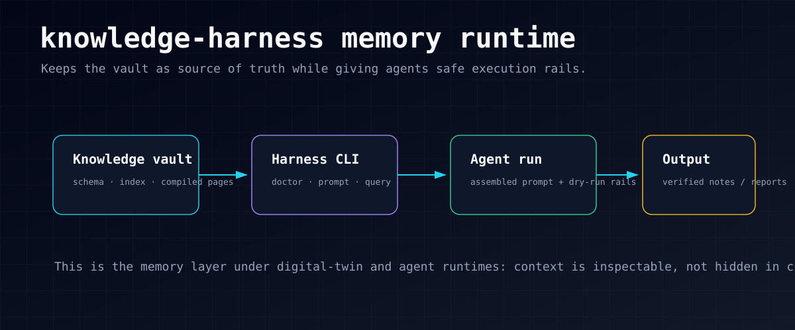

# knowledge-harness

<p align="center">
  
</p>

An external harness repo for Steven Chou's Obsidian knowledge base.

## Part of StevenOS

`knowledge-harness` is the **memory runtime layer** in Steven's Personal AI Operating System.

- **Upstream:** Obsidian vault schema, wiki index, and compiled knowledge pages.
- **This layer:** prompt assembly, health checks, Codex invocation, dry-run rails, and run artifacts.
- **Downstream:** `digital-twin`, Hermes/OpenClaw-style agents, and public proof outputs that depend on durable context.
- **Boundary:** the vault remains the source of truth; this repo stores runtime code, tests, config shape, and sanitized docs.

The vault remains the source of truth for knowledge:

- `AGENTS.md` defines behavior and schema
- `PROMPTS.md` defines reusable task prompts
- `wiki/_index.md` is the routing map

This repo does not store knowledge content. It stores the runtime layer:

- command entrypoints
- prompt assembly
- Codex invocation
- run artifacts and logs
- future improvement proposals

## Why separate it from the vault

The vault is content. The harness is execution.

Keeping them separate avoids mixing markdown assets with scripts, configs, and runtime traces.

## Quick start

```bash
cd knowledge-harness
python3 -m pip install -e .
knowledge-harness demo
```

No Python yet? Open [examples/index.html](examples/index.html) in a browser for
the easiest public-safe demo path.

The demo creates a temporary fake vault, assembles a dry-run prompt, writes
temporary run metadata, and prints the evidence paths. It does not read a real
Obsidian vault, does not require Codex, and does not edit `config/harness.json`.
To use your own harmless question with the same fake-vault safety rails, run:

```bash
knowledge-harness demo --question "What can this fake vault prove?"
```

For a quick browser-friendly proof card, use:

```bash
knowledge-harness demo --html
```

It prints a static, self-contained HTML receipt with the command, question, fake vault
path, run paths, safety claims, evidence checklist, and cleanup command. The
committed public-safe sample is [examples/demo-receipt.html](examples/demo-receipt.html).
For the shortest no-install proof flow, open the
[one-minute demo](examples/one-minute-demo.html).
For a no-install overview of the whole proof flow, open the
[90-second visitor tour](examples/visitor-tour.html).

To save a local proof page you can open or share as a file, use:

```bash
knowledge-harness demo --save-html /tmp/kh-demo/receipt.html
```

It writes the same self-contained receipt to that path and prints a cleanup
command instead of dumping the HTML to the terminal.

For a copy/pasteable proof receipt in a README, issue, or audit note, use:

```bash
knowledge-harness demo --markdown
```

It prints Markdown with the command, question, fake vault path, run paths, safety claims,
evidence to check, and cleanup command:

````markdown
# knowledge-harness demo receipt

command:
```text
knowledge-harness demo --markdown
```

question:
```text
How does this harness route a public-safe question?
```

## Paths

- fake_vault: `/tmp/knowledge-harness-demo-.../fake-vault`
- run_dir: `/tmp/knowledge-harness-demo-.../runs/YYYYMMDD-HHMMSS`
- prompt_file: `/tmp/knowledge-harness-demo-.../runs/YYYYMMDD-HHMMSS/prompt.txt`
- metadata_file: `/tmp/knowledge-harness-demo-.../runs/YYYYMMDD-HHMMSS/run.json`

## Safety claims

- `real_vault_used=false`
- `codex_used=false`
- `write_output=false`
- `dry_run=true`
````

To save that Markdown receipt for a README snippet, GitHub issue, or PR note, use:

```bash
knowledge-harness demo --save-markdown /tmp/kh-demo/receipt.md
```

It writes the same sanitized receipt to that path, overwrites an existing file
at that path, and prints a short saved-path confirmation plus the cleanup
command.

For automation that needs a machine-readable proof receipt, use:

```bash
knowledge-harness demo --json
```

It prints JSON like:

```json
{
  "question": "How does this harness route a public-safe question?",
  "command": "knowledge-harness demo --json",
  "fake_vault": "/tmp/knowledge-harness-demo-.../fake-vault",
  "run_dir": "/tmp/knowledge-harness-demo-.../runs/YYYYMMDD-HHMMSS",
  "prompt_file": "/tmp/knowledge-harness-demo-.../runs/YYYYMMDD-HHMMSS/prompt.txt",
  "metadata_file": "/tmp/knowledge-harness-demo-.../runs/YYYYMMDD-HHMMSS/run.json",
  "status": "no real vault or Codex was used",
  "real_vault_used": false,
  "codex_used": false,
  "write_output": false,
  "dry_run": true,
  "cleanup_root": "/tmp/knowledge-harness-demo-...",
  "cleanup_command": "rm -rf /tmp/knowledge-harness-demo-..."
}
```

For local use with a real vault, copy the example config and edit the private
paths on your machine:

```bash
cp config/harness.example.json config/harness.json
knowledge-harness doctor
knowledge-harness doctor --json
knowledge-harness config
knowledge-harness vault-health
knowledge-harness prompt "基于现有知识库，总结 Steven 当前最值得强化的一个能力杠杆"
knowledge-harness query "基于现有知识库，总结 Steven 当前最值得强化的一个能力杠杆"
knowledge-harness query --model gpt-5.4-mini "用另一个模型跑一次临时实验"
knowledge-harness prompt --language en "Summarize the next capability leverage point from the knowledge base"
```

Use `knowledge-harness doctor --json` when another script or agent needs a
machine-readable health gate for the vault path, Codex binary, model, and run
directory. It preserves the default human-readable `doctor` output for manual
setup checks.

Use `knowledge-harness config` when you only need to inspect the effective local
wiring as JSON. It does not require the configured vault, Codex binary, or run
directory to exist, so it is safe for setup/debugging before `doctor`.

For a public-safe walkthrough that uses a temporary fake vault and no Codex, see
[fake vault demo](docs/FAKE_VAULT_DEMO.md).

Use `knowledge-harness prompt` when an agent or reviewer needs to inspect the
assembled prompt without creating `runs/<timestamp>/` artifacts or invoking
Codex. It still validates the vault contract files because the prompt includes
those files as context.

Use `--language en` with `prompt` or `query` when the assembled answer should be
English. The default is `--language zh`.

The vault health checker is read-only. It scans the configured Obsidian vault for
orphan markdown notes, broken markdown wikilinks, empty notes, duplicate note
titles, stale notes, and high-potential notes worth reviewing:

```bash
knowledge-harness vault-health --stale-days 180 --review-limit 10
knowledge-harness vault-health --json
```

If you want the answer written back into the vault:

```bash
knowledge-harness query \
  "基于现有知识库，总结 Steven 当前最值得强化的一个能力杠杆，并给出未来两周行动建议" \
  --write-output \
  --output-name "digital-twin-demo-2026-04-18.md"
```

## What the harness actually does

1. Reads the knowledge-base entry files from the vault
2. Builds a digital-twin query prompt
3. Calls local `codex exec`
4. Stores the prompt and metadata under `runs/<timestamp>/`
5. Optionally allows Codex to write the final answer back to `wiki/outputs/`

The `vault-health` command does not call Codex and does not write run artifacts.
It treats orphan notes conservatively as markdown notes with no incoming or
outgoing note wikilinks. Non-markdown wikilink targets, such as images, are
ignored when checking broken wikilinks.

## Design direction

For Steven, this should evolve into a `soft harness`, not a loud benchmark rig.

- the user-facing entrypoint remains `digital-twin`
- the harness should activate only for vault-related tasks
- the harness should record runs quietly in the background
- improvement should happen through proposals reviewed by `digital-twin`, not blind auto-mutation

See [ARCHITECTURE.md](docs/ARCHITECTURE.md).

## Repo layout

```text
config/harness.example.json  Public-safe example wiring
config/harness.json          Ignored local wiring for vault path and Codex binary
src/knowledge_harness/     CLI code
runs/                      Prompt snapshots and run metadata
```
